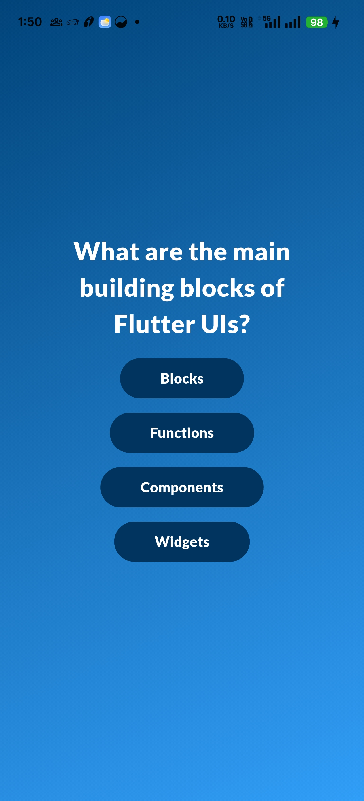
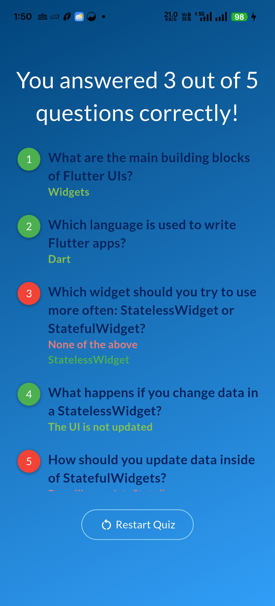

# Flutter Quiz App 🧠📱

A clean, focused Flutter quiz application demonstrating
state-driven UI updates, safe navigation, and reusable UI composition.

The project intentionally uses **local state management** where appropriate,
avoiding unnecessary global state to keep the implementation simple,
predictable, and maintainable.

---

## ✨ Features

- Multi-screen quiz flow (Start → Questions → Results)
- Multiple-choice questions with shuffled answers
- Tracks user selections across questions
- Displays final score with per-question breakdown
- Reusable gradient-based layout and text components
- Defensive navigation handling to prevent invalid routes

---

## 🧱 Architecture & Design Decisions

- **Local State with StatefulWidget**
  - Quiz state is scoped to a single screen
  - Avoided global state management to prevent overengineering

- **Explicit state vs derived data separation**
  - Only mutable data stored as state
  - Derived values computed inside `build()` for consistency

- **Immutable-style state updates**
  - Replaced list mutation with list replacement
  - Prevents subtle bugs and simplifies future refactors

- **Reusable UI components**
  - Common layout (`GradientScaffold`)
  - Custom text widget for consistent styling
  - Isolated result summary widget

- **Safe navigation**
  - Guarded routes using `GoRouterState.extra`
  - Prevents crashes on refresh or direct route access

---

## 🛠 Tech Stack

- Flutter (Material)
- Dart
- go_router (navigation)

---

## 📸 Screenshots

| Start Screen | Questions Screen | Results Screen |
|-------------|------------------|----------------|
|  |  |  |

---

## 🧠 Key Takeaways

- Flutter rebuilds UI based on state changes, not variable mutation
- State should be minimal, explicit, and predictable
- Immutable update patterns reduce future maintenance cost
- Navigation lifecycle must be handled carefully to avoid transient errors
- Clean UI composition improves readability and reuse

---

## 🔮 Possible Enhancements

- Move quiz logic into a ViewModel for testability
- Introduce Riverpod if quiz state needs to be shared across screens
- Add unit tests for scoring logic
- Persist quiz progress locally

---

## 👨‍💻 Author

**GOKUL HARI**  
Software Engineer
